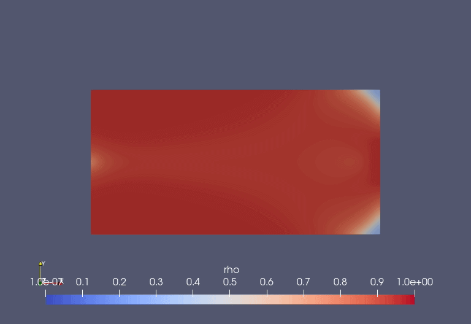
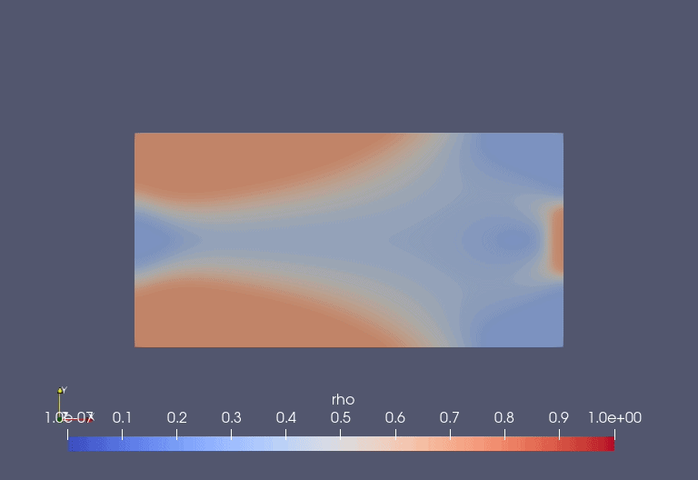
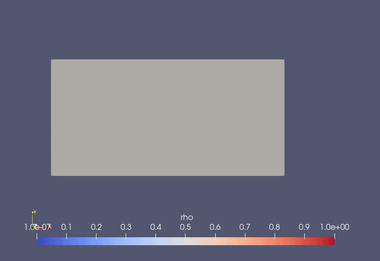
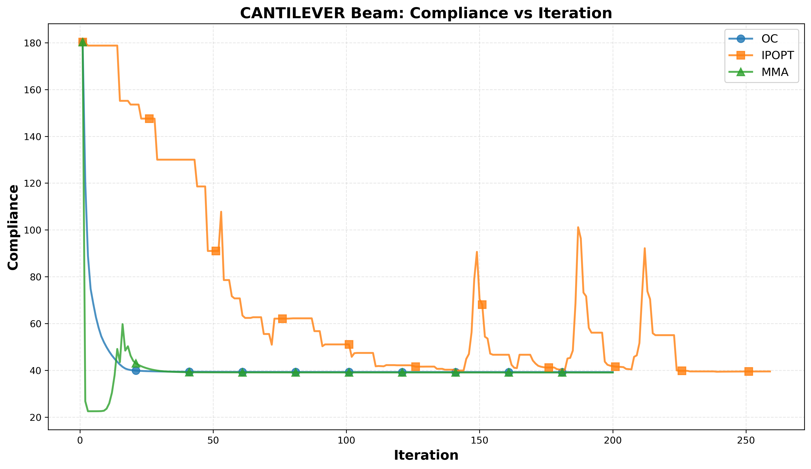
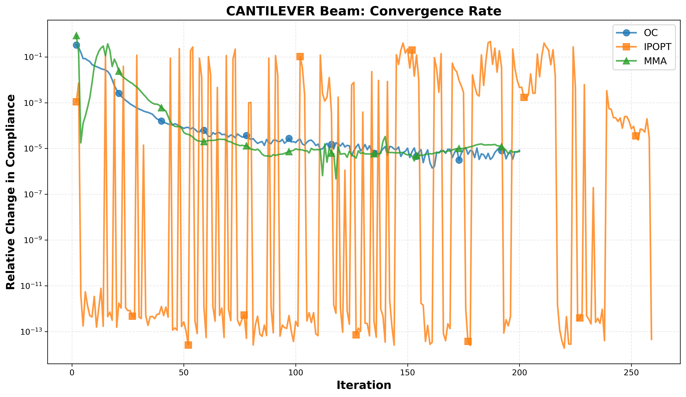
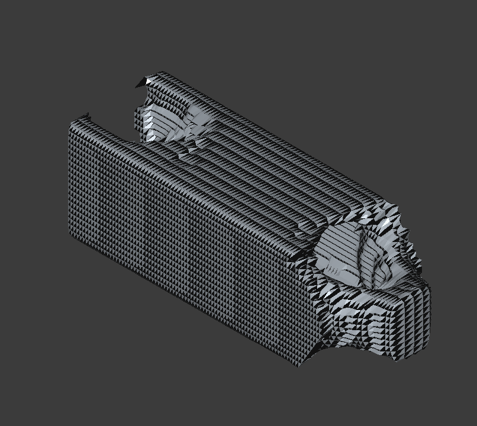

# Topology Optimization of Linear and Nonlinear Elastic Structures

Density-based topology optimization in Python with [FEniCS](https://fenicsproject.org/) (legacy `dolfin`), developed as part of my MSc thesis in Mathematical Modelling, Simulation and Optimization (University of Koblenz).

The project minimizes structural compliance under a volume constraint for both **linear elasticity** and **large-deformation hyperelasticity (compressible Neo-Hookean)**, and compares three optimizers on convergence behaviour: **Optimality Criteria (OC)**, the **Method of Moving Asymptotes (MMA)** and **IPOPT**.



---

## Features

**Finite element models**
- Linear elasticity with P1 elements on a structured 180 × 90 mesh (domain 8 × 4)
- Compressible Neo-Hookean hyperelasticity, formulated with the first Piola–Kirchhoff stress
  P = μ(F − F⁻ᵀ) + λ ln J F⁻ᵀ
- Newton–Raphson solution of the nonlinear weak form, with the consistent tangent obtained by automatic differentiation and a direct MUMPS linear solve
- Stabilization for large deformation: 15-step incremental loading, automatic retry with under-relaxed Newton steps when a load step fails, a safeguard on J against element inversion, and NaN/Inf checks

**Optimization**
- SIMP material interpolation (penalization p = 3, Emin = 1e-9 linear / 1e-6 nonlinear)
- Optimality Criteria with bisection on the Lagrange multiplier and move limit 0.2
- MMA adapted from Svanberg's method, with the convex subproblem solved by IPOPT
- IPOPT through `cyipopt`, using a limited-memory (L-BFGS) Hessian approximation
- Helmholtz-type PDE filter for densities and sensitivities, against checkerboarding and mesh dependence

**Benchmarks**
- Half-MBB beam, cantilever beam and simply supported beam (linear case)
- Cantilever beam (nonlinear case)
- 3D cantilever extension

---

## Repository structure

```
Topology_Optimization/
├── src/
│   ├── Linear Elasticity SIMP.py                          # Linear SIMP: OC, MMA and IPOPT compared, with PDE filter
│   ├── Non Linear elasticity without fiter using MMA.py   # Neo-Hookean solver with load stepping, optimized with MMA
│   └── mmaa_al.py                                         # MMA (adapted from Svanberg) with IPOPT subproblem solver
└── results/
    ├── cantilever/
    │   ├── imgs/     # Final designs and design-evolution GIFs (OC, MMA, IPOPT, filter variants)
    │   └── logs/     # Compliance and convergence comparison plots
    ├── 3d_cant.png
    └── BMM Different Constraints.gif
```

---

## Requirements

- Python 3
- FEniCS 2019.1 (legacy `dolfin`)
- NumPy, SciPy, Matplotlib
- `cyipopt` (IPOPT Python interface)

### Option 1: Docker (recommended, works on Windows, macOS and Linux)

Install [Docker Desktop](https://www.docker.com/products/docker-desktop/), then start the official legacy FEniCS image from the repository folder, mounting it into the container:

```bash
# Linux / macOS
docker run -ti -v "$(pwd)":/home/fenics/shared quay.io/fenicsproject/stable:latest

# Windows (PowerShell)
docker run -ti -v "${PWD}:/home/fenics/shared" quay.io/fenicsproject/stable:latest
```

Inside the container, install IPOPT and `cyipopt`:

```bash
sudo apt-get update
sudo apt-get install -y coinor-libipopt-dev pkg-config
pip3 install --user cyipopt==1.1.0
cd ~/shared/src
```

FEniCS, NumPy, SciPy and Matplotlib are already included in the image.

### Option 2: conda

```bash
conda create -n topopt -c conda-forge fenics cyipopt numpy scipy matplotlib
conda activate topopt
```

---

## Usage

Run the scripts from inside `src/` so that `mmaa_al.py` can be imported.

**Linear case (compares OC, MMA and IPOPT):**

```bash
cd src
python "Linear Elasticity SIMP.py"
```

Select the benchmark by editing `BEAM_TYPE` at the top of the script: `'half_mbb'`, `'cantilever'` or `'simply_supported'`. Results are written to `results_<BEAM_TYPE>_comparison/`, including ParaView (`.pvd`) files of the density and displacement fields, convergence plots and a summary of each method.

**Nonlinear case (Neo-Hookean, MMA):**

```bash
cd src
python "Non Linear elasticity without fiter using MMA.py"
```

Results are written to `nonlinear_topology_mma_nofilter/`, with density and displacement fields as `.pvd` files.

Main parameters (volume fraction, penalization, filter radius, iterations, load magnitude) are defined at the top of each script.

---

## Results

| Optimality Criteria | MMA | IPOPT |
|:---:|:---:|:---:|
|  |  |  |

**Convergence comparison (cantilever):**





**3D cantilever:**



---

## Method overview

The design variable is a density field ρ ∈ [0, 1]. Young's modulus is interpolated as

E(ρ) = Emin + ρᵖ (E0 − Emin),

and the optimization problem is

minimize c(ρ) = ∫ t · u ds   subject to   (1/|Ω|) ∫ ρ dx = V*,   0 ≤ ρ ≤ 1,

where u solves the (linear or nonlinear) elasticity equations for the given density. In the linear case, compliance is self-adjoint, so sensitivities come directly from the strain energy density. In the nonlinear case, the same energy-based expression is used as an approximation.

---

## Limitations and next steps

- The nonlinear sensitivities use an energy-based approximation rather than a full adjoint solve. Deriving and implementing the full adjoint for the hyperelastic problem is the natural next step.
- The nonlinear script currently runs without a filter.
- Extending the nonlinear framework to 3D and to contact boundary conditions.

---

## Acknowledgements

The MMA implementation in `mmaa_al.py` is adapted from K. Svanberg, *The method of moving asymptotes — a new method for structural optimization*, International Journal for Numerical Methods in Engineering, 24(2), 1987. The subproblem solver was replaced with IPOPT.

## Author

**Harsha Adari** — MSc Mathematical Modelling, Simulation and Optimization, University of Koblenz
